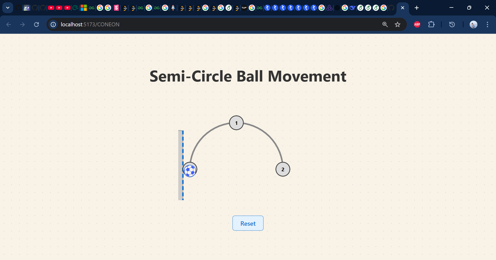

# Semi-Circle Ball Movement React App

This project is a simple interactive React app built with Vite. It demonstrates a ball (⚽ emoji) moving smoothly along a semicircular path when you click on any of the three points on the arc. The app also displays a floor image below the semicircle for a more visually appealing effect.

## Features
- **Animated Ball Movement:** The ball animates along the arc between points when clicked.
- **SVG Graphics:** The semicircle, points, and ball are rendered using SVG for crisp visuals.
- **Customizable Floor:** You can use any image as the floor by placing it in the `public` folder and updating the image source in the code.

## Demo


*If you want to use a grass or ground image, download a free PNG (e.g., from [pngall.com](https://www.pngall.com/grass-png/)) and save it as `public/grass.png`. Then, update the image source in `App.jsx` to use `/grass.png`.*

## How It Works
- The semicircle is drawn using an SVG `<path>`.
- Three clickable points are placed evenly along the arc.
- The ball (⚽) is an SVG `<text>` element that animates its position along the arc using React state and `requestAnimationFrame`.
- The floor image is displayed below the semicircle for a ground effect.

## Getting Started
1. **Install dependencies:**
   ```sh
   npm install
   ```
2. **Run the development server:**
   ```sh
   npm run dev
   ```
3. **Open your browser:**
   Visit [http://localhost:5173](http://localhost:5173) (or the port shown in your terminal).

## Project Structure
```
public/
  grass.png         # (Optional) Floor image
  diagram.jpg       # (Default) Floor image
src/
  App.jsx           # Main React component
  App.css           # Styling
```

## Screenshots
### Ball at 0th Index


### Ball at 1st Index


### Ball at 2nd Index


*Replace these screenshots with your own if you want to show your custom floor or ball graphics!*

## Customization
- To use a different floor image, place your image in the `public` folder and update the `` in `App.jsx`.
- You can increase the number of points by changing `NUM_POINTS` in `App.jsx`.
- Change the emoji or use an SVG for a different ball style.

---

*This project was bootstrapped with [Vite](https://vitejs.dev/) and uses React for UI rendering.*
